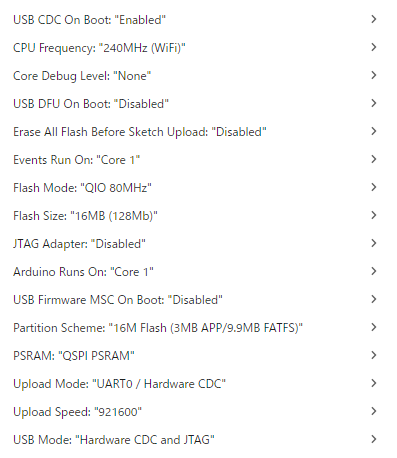
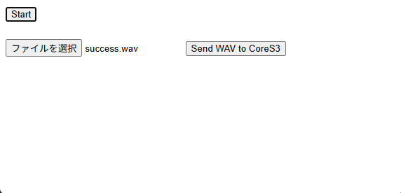

# m5_petit

M5CoreS3 を使ったロボット顔デバイス。

📷 カメラ / 🎤 マイク / 🖼 顔表示 / 🔊 音声再生 / 📡 センサー / 👆 タッチ

---

## できること

- HTTP でカメラ画像を取得
- WebSocket でコマンド送信（視線・表情・音声・スリープ等）
- WebSocket でマイク音声をリアルタイム配信（MIC_STARTで開始）
- WebSocket でセンサー・タッチイベントを受信
- SDカードの顔画像スライドショー
- SDカードのWAVファイル再生

---

## 必要なハードウェア

- M5CoreS3
- microSDカード（FAT32）
- WiFi環境（テザリング可）

> ⚠️ iPhoneテザリングでは WebSocket 通信が失敗することがあります

---

## 導入手順

### WiFi設定（共通）

`m5_script/credentials.example.h` をコピーして `m5_script/credentials.h` を作成：

```bash
cp m5_script/credentials.example.h m5_script/credentials.h
```

`credentials.h` を編集して実際の値を入れる：

```cpp
const char* ssid1 = "スマホテザリングのSSID";    // 外出時
const char* pass1 = "パスワード";
const char* ssid2 = "家のWiFiのSSID";             // 自宅
const char* pass2 = "パスワード";
const char* ssid3 = "旅行用ルーターのSSID";       // GL.iNET等（任意）
const char* pass3 = "パスワード";

// WireGuard（任意。使わない場合もビルドは通る）
#define WG_SERVER_PUBLIC_KEY  "..."
#define WG_SERVER_IP          "..."   // PCのTailscale IPなど
#define WG_SERVER_PORT        51820
// キャラクターごとのWireGuard秘密鍵
#define WG_PUCHIRU_PRIVATE_KEY  "..."
```

ssid1 に3回接続を試み、失敗したら ssid2、それも失敗したら ssid3 にフォールバック。切断時の再接続も同様。

固定IPはソース内の `STATIC_IP_LAST` / `HOME_IP_LAST` / `ROUTER_IP_LAST` で各キャラクターのIPを設定。

---

### 方法A: Arduino IDE（現在推奨）

> ⚠️ PlatformIO はライブラリのバージョン依存問題により、現在ビルドが通っても動作にバグが出ることがあります。**Arduino IDE での書き込みを推奨**します。

#### 1. ボード追加

ファイル > 環境設定 > 追加のボードマネージャURL に追加：

```
https://static-cdn.m5stack.com/resource/arduino/package_m5stack_index.json
```

ツール > ボード > ボードマネージャ → `M5Stack` をインストール

ボード設定：



#### 2. ライブラリインストール

- M5CoreS3 (1.0.1)
- M5Stack (0.4.6)
- M5Unified (0.2.13)
- SD (1.3.0)
- [WebSockets by Links2004](https://github.com/Links2004/arduinoWebSockets)（ZIPダウンロードして追加）
- [WireGuard-ESP32](https://github.com/ciniml/WireGuard-ESP32-Arduino)（ZIPダウンロードして追加。VPN不要の場合も必要）

#### 3. 書き込み

キャラクターごとの .ino を Arduino IDE で開いて書き込む：

- `m5_script/m5_petit_puchiteya/m5_petit_puchiteya.ino`
- `m5_script/m5_petit_puchiko/m5_petit_puchiko.ino`
- `m5_script/m5_petit_puchiru/m5_petit_puchiru.ino`

それぞれ対応する M5CoreS3 を USB 接続した状態で「マイコンボードに書き込む」を実行。

---

### 方法B: PlatformIO

```bash
pip install platformio
# または VS Code の PlatformIO IDE 拡張をインストール
```

3つの環境（`puchiko` / `puchiteya` / `puchiru`）があり、それぞれ別の .ino をビルドする。
`select_source.py` が `m5_script/m5_petit_<env>/m5_petit_<env>.ino` を自動で `src/` にコピーする。

```bash
# ビルド＆書き込み
pio run -e puchiko -t upload
pio run -e puchiteya -t upload
pio run -e puchiru -t upload

# シリアルモニタ
pio device monitor
```

> ⚠️ 複数の環境を同時にビルド（`pio run`）するとメモリ不足で落ちることがあります。1つずつビルドしてください。

ビルド済みの .ino は `~/petit_claude/characters/<キャラ名>/` にもコピーされています（バックアップ兼参照用）。

---

## SDカード準備

`./sd.zip` を解凍してSDカード（FAT32）のルートに配置：

```
/
├── face/   ← 顔画像 (.jpg)
└── wav/    ← 効果音 (.wav) ※ 16bit PCM, Mono, 16000Hz
```

WAVが聞こえない場合は Audacity でモノラル変換する。

---

## IPアドレス確認

起動後30秒間、画面右下（テキストサイズ1）に緑色でIPアドレスが表示される。シリアルモニタ（115200baud）でも確認可能。

mDNS対応のため、IPアドレスの代わりにホスト名でもアクセス可能：

- ぷちこ: `http://puchiko.local/`
- ぷちてゃ: `http://puchiteya.local/`

> ホスト名は `MDNS_HOSTNAME` で設定。WebSocketも `ws://puchiko.local:8080` で接続可能。

---

## HTTP API

| エンドポイント | 説明 |
|---|---|
| `GET /help` | API一覧 |
| `GET /snapshot` | カメラ撮影（JPEG） |
| `GET /face_list` | 顔画像ファイル一覧（JSON） |
| `GET /face_play?name=xxx.jpg` | 顔画像を5秒表示 |
| `GET /face_draw_mode` | 描画モードへ切替 |
| `GET /face_play_mode` | スライドショーモードへ切替 |
| `GET /set_face_draw?eyeX=&eyeY=&mouth=` | 視線・口の制御（5秒後に戻る） |
| `GET /blink?left=true&right=false` | ウィンク |
| `GET /se_list` | 効果音ファイル一覧（JSON） |
| `GET /se_play?name=xxx.wav` | 効果音再生 |
| `GET /setvolume?value=0~100` | 音量変更 |
| `GET /getvolume` | 現在の音量取得（0〜100） |
| `GET /icon_list` | アイコン一覧 |
| `GET /icon_play?name=love\|cry` | アイコン表示（3秒） |
| `GET /set_color?color=RRGGBB` | 顔の色変更 |
| `GET /status` | 状態取得（is_sleeping, power_save） |
| `GET /setbrightness?value=0~100` | 画面輝度変更 |
| `GET /getbrightness` | 画面輝度取得 |
| `GET /sensors` | センサーデータ取得（IMU/照度/近接/バッテリー/RSSI） |
| `GET /powersave?value=true\|false` | 省電力モード切替（輝度制限+描画10fps） |
| `GET /getpowersave` | 省電力モード状態取得 |
| `GET /sleep` | スリープモード |
| `GET /wake` | スリープから復帰 |
| `POST /upload_wav` | WAVファイルをSDにアップロード（multipart/form-data） |
| `POST /upload_face` | 顔画像(JPG)をSDにアップロード（multipart/form-data） |

---

## WebSocket API

接続先：`ws://<IPアドレス>:8080`

### クライアント → M5（コマンド）

テキストメッセージで送信。

| コマンド | 説明 |
|---|---|
| `LOOK x y` | 視線移動。x/y: -100〜100。5秒後に正面へ戻る |
| `LOOK x y mouth` | 視線＋口の開き（mouth: 0〜100） |
| `BLINK l r` | ウィンク。l/r: 0か1。0.8秒後に戻る |
| `MODE draw` | 描画モード（目・口をリアルタイム描画） |
| `MODE jpeg` | スライドショーモード（SDのJPEGを3秒ごとに表示） |
| `PLAY filename.wav` | WAVファイルを再生 |
| `VOL value` | 音量設定（0〜100） |
| `ICON love` | ハートアイコンを3秒表示 |
| `ICON cry` | 涙アイコンを3秒表示 |
| `MIC_START` | マイクをオンにして音声ストリーム開始 |
| `MIC_STOP` | マイクをオフ |
| `COLOR RRGGBB` | 顔の色変更 |
| `BRIGHTNESS value` | 画面輝度設定（0〜100） |
| `POWERSAVE ON` | 省電力モードON |
| `POWERSAVE OFF` | 省電力モードOFF |
| `SLEEP` | スリープモード（3回タッチで復帰） |
| `WAKE` | スリープから復帰 |

音声を送る場合は PCM バイナリ（int16, Mono, 16000Hz）を送り、最後に `END` を送る。

### M5 → クライアント（イベント）

#### センサーデータ（250ms周期）

```json
{
  "event": "sensors",
  "ambient": 342,
  "proximity": 120,
  "ax": 0.01, "ay": -0.98, "az": 0.12,
  "gx": 0.00, "gy": 0.02, "gz": -0.01,
  "battery": 83.4,
  "voltage": 3.982,
  "rssi": -45
}
```

#### タッチイベント

```json
{
  "event": "touch",
  "x": 120,
  "y": 200
}
```

#### マイク音声（MIC_START後）

バイナリ（int16, Mono, 16000Hz, 約30ms毎）

#### 録音終了イベント

無音タイムアウト（5秒）または最大録音時間（30秒）に達したとき、マイクを停止して送信：

```json
{ "event": "mic_end" }
```

---

## 省電力モード

`/powersave?value=true` またはWSで `POWERSAVE ON` で有効化。

- 画面輝度を40以下に制限
- 顔の描画を30fps→10fpsに削減
- バッテリー持ち改善（おでかけ時に推奨）

## 低バッテリー自動スリープ

バッテリー残量が10%以下になると自動的にスリープモードに入る。完全放電を防止。

> バッテリー0%は充電中を意味するため、自動スリープの対象外。

## ファイルアップロード

SDカードを抜き差しせずにHTTPでファイルを追加できる。

```bash
# WAVファイルをアップロード
curl -F "file=@hello.wav" http://<IP>/upload_wav

# 顔画像をアップロード
curl -F "file=@smile.jpg" http://<IP>/upload_face
```

## タッチ反応

タッチすると脊髄反射で目をつぶる（まばたき）。タッチイベントはWSでも配信される。

### タッチメニュー

- **タップ**: メニューオーバーレイを表示（5秒で自動消去）
- **スワイプ/長押し後離す**: メニューを閉じる（pon.wav が鳴る）

メニューは画面を4分割した2×2グリッド：

| 左上: CAM | 右上: SEN |
|---|---|
| 左下: MIC | 右下: SET |

- **CAM / SEN / MIC** を選択すると `{"event":"menu_select","item":"camera"|"sensor"|"mic"}` をWSに送信
- **SET** を選択すると設定画面に遷移

### 設定画面（SET）

| エリア | 操作 | 機能 |
|---|---|---|
| BRIGHTNESS | 左タップ: 下げる / 右タップ: 上げる | 画面輝度（5段階: 100/75/50/5/0%） |
| VOLUME | 左タップ: 下げる / 右タップ: 上げる | 音量（5段階: 100/75/50/25/0%） |
| PSAVE | タップ | 省電力モードON/OFFトグル |
| `< BACK` | タップ | 設定画面を閉じる |

## ステータス表示

録音・撮影・センサー送信中は画面右上に状態テキストが表示される：

| 表示 | 意味 |
|------|------|
| `CAM` | スナップショット取得中 |
| `MIC` | マイク録音中（目が左右にゆれる） |
| `SEN` | センサーデータ送信（3秒表示） |

WiFi接続エラー時は `WiFi ERROR` が優先表示される。

## マイク録音の停止条件

以下のいずれかで自動停止し `mic_end` イベントを送信：

- **無音5秒**（`SILENCE_TIMEOUT_MS`）: 最後に音を検知してから5秒経過
- **最大30秒**（`MIC_MAX_DURATION_MS`）: うるさい環境でも必ず終了

録音中は目が sin 波で左右にゆれ、停止時に正面に戻る。

## 注意事項

- **マイクとスピーカーは同時使用不可**（I2S/DMA競合）。再生中はマイク停止、録音中はスピーカー停止。
- **マイクは接続時に自動起動しない**。`MIC_START` コマンドで明示的に起動すること。

---

## ネットワーク構成

### WiFiフォールバック

M5 は起動時に以下の順で WiFi 接続を試みる：

| 優先度 | SSID | 固定IP | 用途 |
|---|---|---|---|
| 1 | ssid1（スマホ） | 10.42.138.x | テザリング外出時 |
| 2 | ssid2（家） | 192.168.1.x | 自宅WiFi |
| 3 | ssid3（ルーター） | 192.168.8.x | GL.iNET MT3000経由 |

すべて失敗した場合は 5 秒ごとに再試行（ssid3×1回 → ssid1×1回 → ssid2×1回 → ループ）。

### 外出時の接続構成（MT3000 + Tailscale）

```
[外出先]
スマホ（テザリング）
    └─ WAN → [GL.iNET MT3000]
                  └─ LAN（192.168.8.0/24）
                        ├─ M5（192.168.8.100〜102）
                        └─ （他のデバイス）

[家のPC]
    └─ Tailscale ──────────── MT3000（Tailscale ノード）
                              ↓ サブネットルート 192.168.8.0/24
                              M5 に直接アクセス可能
```

- MT3000 は **家に設置したまま**。外出時に持ち出さない。
- M5 は MT3000 の WiFi（ssid3）に接続し、192.168.8.x の固定IPを取得。
- PC は Tailscale で MT3000 に接続し、192.168.8.x 宛のパケットを MT3000 経由でルーティング。
- ポートフォワードは不要（Tailscale が NAT 越えを処理）。

### セキュリティ

| 項目 | 対策 |
|---|---|
| credentials.h | `.gitignore` 済み。リポジトリにコミットされない |
| WireGuard 秘密鍵 | credentials.h に記載。キャラクターごとに別鍵 |
| Tailscale | ed25519 ベースの相互認証。管理コンソールで承認したデバイスのみ参加可 |
| M5 HTTP API | 認証なし。Tailscale ネットワーク内のデバイスのみアクセス可（インターネット非公開） |
| MT3000 管理画面 | 強いパスワードを設定すること |

**リスクの整理：**
- M5 は認証なしの HTTP サーバー。Tailscale ネットワーク参加者は誰でも操作できる。
- Tailscale アカウントが乗っ取られると M5 への不正アクセスが可能になる → 2FA を有効化すること。
- テザリング中（ssid1 接続時）は WireGuard も起動するが、PC が起動していなければ接続は成立しない。

---

## テスト用HTML

`test.html` をブラウザで開くと、WS接続・マイク音声受信・WAV送信をブラウザから試せる。


